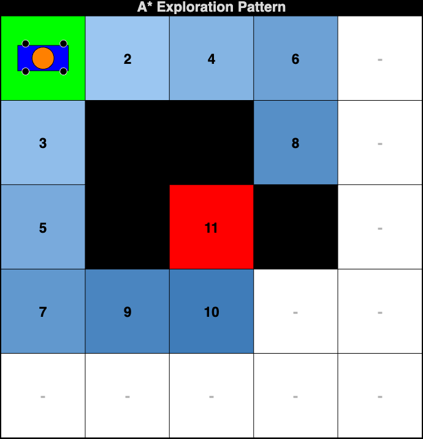
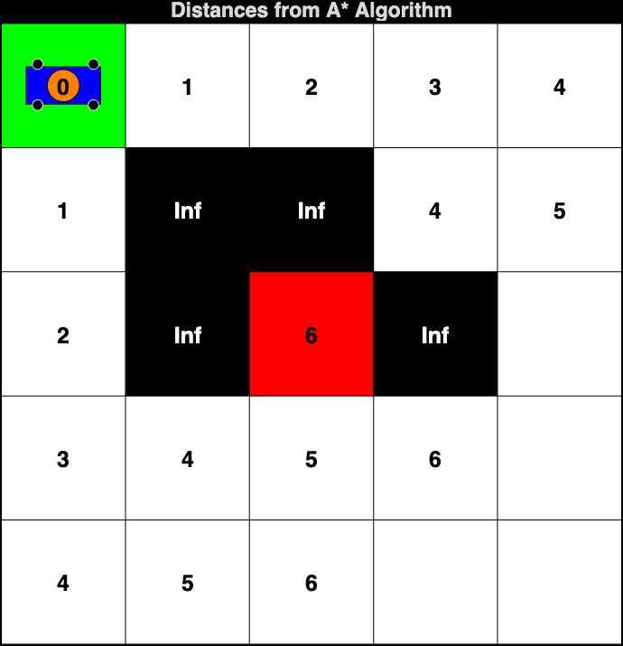
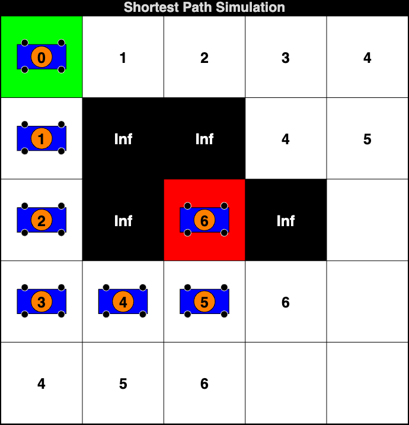

# A* Pathfinding Algorithm Simulation

This project implements the **A* (A-Star) Algorithm** for pathfinding in a grid-based environment, simulating the movement of a robot from a start cell to a goal cell while avoiding obstacles. The simulation visualizes the grid, the heuristic-guided exploration pattern, the distances computed by A*, and the shortest path found.

## Table of Contents
- [Introduction](#introduction)
- [Features](#features)
- [Requirements](#requirements)
- [Usage](#usage)
  - [Parameters](#parameters)
  - [Example](#example)
- [How A* Works](#how-a-works)
- [File Structure](#file-structure)
- [Results](#results)
  - [A* Exploration Pattern](#a-exploration-pattern)
  - [Distances from A* Algorithm](#distances-from-a-algorithm)
  - [Shortest Path](#shortest-path)
  - [Shortest Path Simulation](#shortest-path-simulation)
- [License](#license)
- [Acknowledgments](#acknowledgments)
- [References](#references)

## Introduction
This project implements a robot pathfinding simulation using the A* algorithm on a grid-based environment. Unlike the Grassfire (BFS) algorithm which explores all reachable cells uniformly, A* uses a **Manhattan distance heuristic** to intelligently guide the search toward the goal. This results in significantly fewer cells explored while still guaranteeing the shortest path — making A* one of the most efficient informed search algorithms.

## Features
- **Grid Visualization**: Displays a grid with start (green), goal (red), and obstacle (black) cells.
- **Heuristic Search**: Implements the A* algorithm with Manhattan distance heuristic `f(n) = g(n) + h(n)`.
- **Exploration Visualization**: Color-coded display showing the order in which A* explores cells, demonstrating how the heuristic focuses the search.
- **Distance Display**: Shows the computed g-values (cost from start) for each explored cell.
- **Shortest Path Simulation**: Visualizes the robot's movement along the optimal path to the goal.
- **Robot Representation**: The robot is represented as a blue rectangle with wheels and an orange top mount.
- **MATLAB Graphics**: Utilizes MATLAB's graphical capabilities to create an interactive simulation experience.

## Requirements
- MATLAB (preferably R2018b or later)

## Usage
Clone this repository and run the `start_simulation.m` file, providing the grid dimensions, start cell, goal cell, and obstacles as input parameters.

### Parameters
To run the simulation, call the `start_simulation` function with the appropriate parameters:

```matlab
start_simulation(m, n, startCell, goalCell, obstacles)
```

- `m`: Number of rows in the grid.
- `n`: Number of columns in the grid.
- `startCell`: Linear index of the start cell (row-major order).
- `goalCell`: Linear index of the goal cell (row-major order).
- `obstacles`: Array of linear indices representing obstacle cells.

### Example

```matlab
m = 5; % Number of rows
n = 5; % Number of columns
startCell = 1; % Start cell index
goalCell = 13; % Goal cell index
obstacles = [7, 8, 12, 14]; % Obstacle cells

start_simulation(m, n, startCell, goalCell, obstacles);
```

## How A* Works
The A* algorithm finds the shortest path by combining actual cost with a heuristic estimate:

- **g(n)**: The actual cost from the start cell to cell `n`.
- **h(n)**: The heuristic estimate (Manhattan distance) from cell `n` to the goal.
- **f(n) = g(n) + h(n)**: The total estimated cost of the cheapest path through cell `n`.

### Algorithm Steps
1. **Initialize**: Set the start cell's g-value to `0`. Compute `f = 0 + h(start)`.
2. **Priority Queue**: Maintain an open list sorted by f-value (lowest first).
3. **Expand**: Remove the cell with the lowest f-value. If it is the goal, stop.
4. **Update Neighbors**: For each unvisited neighbor, compute `tentative_g = g(current) + 1`. If better than the neighbor's current g-value, update and add to the open list.
5. **Path Reconstruction**: Backtrack from the goal to the start using parent pointers.

### Key Advantages over Grassfire (BFS)
| Property | Grassfire (BFS) | A* Algorithm |
|----------|----------------|--------------|
| Search Strategy | Uniform expansion from goal | Heuristic-guided from start |
| Cells Explored | All reachable cells | Only necessary cells |
| Data Structure | FIFO Queue | Priority Queue (by f-value) |
| Heuristic | None | Manhattan distance |
| Optimality | Guaranteed | Guaranteed (with admissible heuristic) |

### Simulation Workflow
The simulation runs in 4 phases:
1. **Problem Statement** — Grid display with start, goal, and obstacles.
2. **Exploration Pattern** — Color-coded cells showing the order A* explored them (fewer than Grassfire).
3. **Distance Display** — g-values (cost from start) overlaid on the grid.
4. **Path Simulation** — Animated robot following the pre-computed optimal path.

## File Structure
The project consists of the following MATLAB functions:

- **`start_simulation.m`**: The main entry point that initiates the 4-phase simulation workflow.

- **`display_grid.m`**: Displays the grid with the start cell (green), goal cell (red), and obstacles (black).

- **`astar_algorithm.m`**: Implements the A* algorithm using Manhattan distance as the heuristic function. Uses a priority queue (open list sorted by f-value) and tracks exploration order. Returns the optimal path, g-values, cells explored count, and exploration order matrix.

- **`display_exploration.m`**: Visualizes the A* exploration pattern with a color gradient showing the order in which cells were explored. Unexplored cells remain white, demonstrating the heuristic's effectiveness.

- **`display_distances.m`**: Overlays the computed g-values (cost from start) on the grid for all explored cells.

- **`shortest_path.m`**: Animates the robot moving step-by-step along the pre-computed A* optimal path.

- **`draw_robot.m`**: Draws the robot's representation on the grid. The robot features a blue rectangular body, black wheels, and an orange circular top mount.

- **`index_to_rowcol.m`**: Converts a linear cell index to its corresponding row and column indices using **row-major order** (left-to-right, top-to-bottom).

## Results

### A* Exploration Pattern


### Distances from A* Algorithm


### Shortest Path


### Shortest Path Simulation


## License
This project is licensed under the MIT License. See the LICENSE file for details.

## Acknowledgments
- Inspired by algorithms for pathfinding and robotics.

## References
1. **A* Algorithm**:
   - P. E. Hart, N. J. Nilsson, and B. Raphael, "A Formal Basis for the Heuristic Determination of Minimum Cost Paths," *IEEE Transactions on Systems Science and Cybernetics*, vol. 4, no. 2, pp. 100-107, 1968.
   - [Wikipedia: A* search algorithm](https://en.wikipedia.org/wiki/A*_search_algorithm)

2. **Heuristic Functions**:
   - S. Russell and P. Norvig, *Artificial Intelligence: A Modern Approach*, 4th ed. Pearson, 2020.

3. **Pathfinding Algorithms**:
   - A. Botea, M. Muller, and J. Schaeffer, "Near Optimal Hierarchical Path-Finding," *Journal of Game Development*, vol. 1, no. 1, pp. 7-28, 2004.

4. **Mobile Robots**:
   - B. Siciliano et al., *Springer Handbook of Robotics*, 2nd ed. Springer, 2016.
   - R. Siegwart, I. R. Nourbakhsh, and D. Scaramuzza, *Introduction to Autonomous Mobile Robots*, 2nd ed. MIT Press, 2011.

5. **MATLAB Graphics**:
   - MATLAB Documentation: [Graphics](https://www.mathworks.com/help/matlab/graphics.html)
